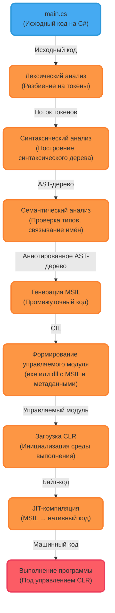

---

## **Объяснение каждого этапа:**

## Лексический анализ

>  На этом этапе исходный код разбивается на **лексемы** — осмысленные фрагменты текста, такие как имена переменных, ключевые слова, числа или операторы. Каждой лексеме сопоставляется **токен**, представляющий её категорию (например, _идентификатор_, _ключевое слово_, _строковый литерал_) и значение. Пробелы и комментарии игнорируются, так как они не влияют на смысл программы.

## Синтаксический анализ

>  Поток токенов преобразуется в **синтаксическое дерево**, отражающее структуру программы: какие блоки вложены в другие, где начинаются и заканчиваются методы, как связаны выражения. На этом этапе проверяется, соответствует ли код правилам грамматики языка C# — например, правильно ли расставлены фигурные скобки или точки с запятой.

## Семантический анализ

>  Здесь проверяется **смысловая корректность** программы: объявлены ли используемые переменные, совпадают ли типы в операциях, существуют ли вызываемые методы. Компилятор создаёт таблицу символов и связывает каждое имя в коде с его объявлением, чтобы убедиться в логической согласованности программы.

## Генерация промежуточного кода (MSIL)

>  После всех проверок компилятор C# преобразует код в **MSIL** (промежуточный язык Microsoft) — платформенно-независимый байт-код, понятный среде выполнения .NET. Вместе с ним в файл записываются **метаданные**, описывающие все типы, методы и зависимости программы. Всё это упаковывается в обычный **exe- или dll-файл**, который, однако, не может выполняться напрямую процессором.

## Формирование управляемого модуля

>  Результат компиляции — **управляемый модуль**, содержащий MSIL, метаданные и служебную информацию для среды выполнения. Такой файл не является машинным кодом и для его запуска требуется **CLR** (Common Language Runtime). Именно CLR отвечает за дальнейшее преобразование этого кода в исполняемую программу.

## Загрузка среды выполнения (CLR)

>  При запуске exe-файла операционная система определяет, что он предназначен для выполнения в среде .NET, и инициализирует CLR, которая затем берёт на себя управление выполнением программы: загружает сборку, находит метод `Main` и готовится к запуску.

## JIT-компиляция

>  CLR использует **JIT-компилятор** (Just-In-Time), чтобы **по мере необходимости** преобразовывать MSIL в настоящий **машинный код**, понятный процессору. Каждый метод компилируется только при первом вызове, после чего его нативная версия сохраняется в памяти. Это позволяет избежать ненужной работы с неиспользуемыми частями программы и адаптировать код под конкретную архитектуру процессора.

## Выполнение программы

>  После JIT-компиляции управление передаётся сгенерированному машинному коду, который выполняется процессором. Однако программа по-прежнему работает **под контролем CLR**, которая обеспечивает такие функции, как автоматическая сборка мусора, обработка исключений, проверка безопасности и управление памятью. Такой код называют **управляемым**, поскольку его выполнение полностью контролируется средой .NET.

%% ## Токен и лексема:

**Лексема** — это конкретная подстрока в исходном коде, например `Console` или `"Hello"`.  
**Токен** — это абстрактное представление лексемы, состоящее из категории (например, _идентификатор_ или _строковый литерал_) и значения.

>Лексема — это «то, что написано», а токен — «то, как это интерпретирует компилятор». %%